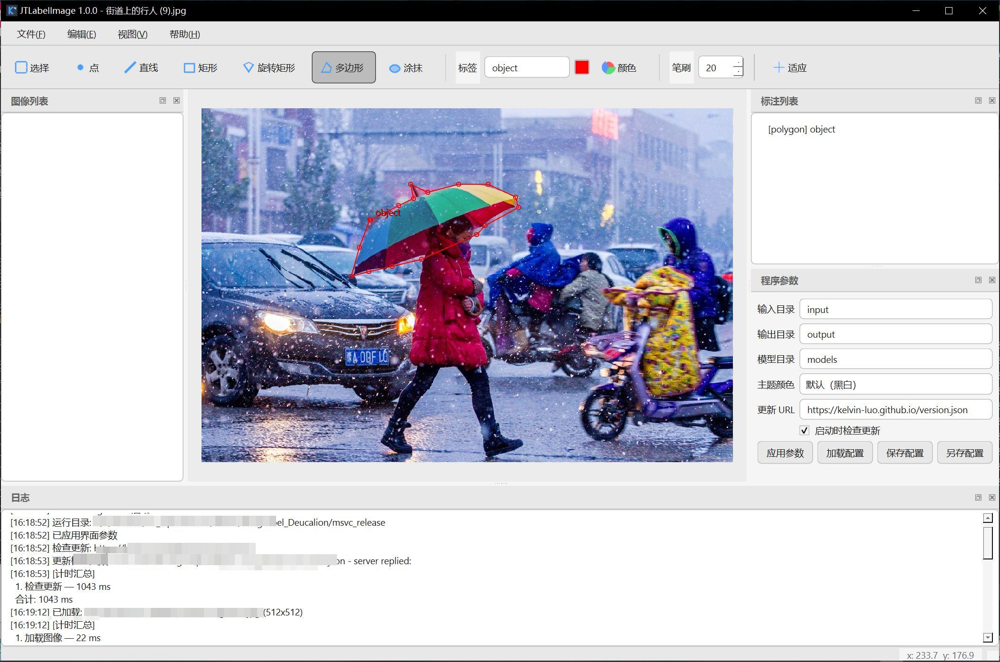

# JTLabelImage — 基于 Qt6 / OpenCV 的图像标注工具

类似 labelme 的轻量级图像标注工具，支持：点、直线、矩形、旋转矩形、多边形、涂抹区域（mask）。


## 截图



---

## 快速开始

```bat
cd code
build.bat
run.bat
```


---

## 主要功能

| 功能 | 说明 |
| ---- | ---- |
| 标注工具 | 点 / 直线 / 矩形 / 旋转矩形 / 多边形 / 涂抹 |
| 日志区 | 底部停靠窗输出操作日志 |
| 分步计时 | 关键步骤计时并汇总打印 |
| 程序配置 | 加载 / 保存 / 另存 JSON；参数均在界面可改 |
| 主题颜色 | 默认黑白 / 浅绿 / 浅蓝 / 深蓝 / 暗黑 / 浅黄 / 橙色 |
| 关于 | 显示 CMake 项目版本号 |
| 自动升级 | 请求 GitHub Pages `version.json`，可下载安装包 |

---

## JSON

- **标注数据**：`output/<basename>.json`（涂抹另存灰度 PNG）
- **程序配置**：`klabel_config.json`

