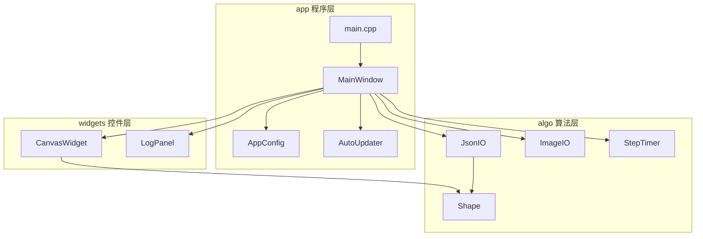
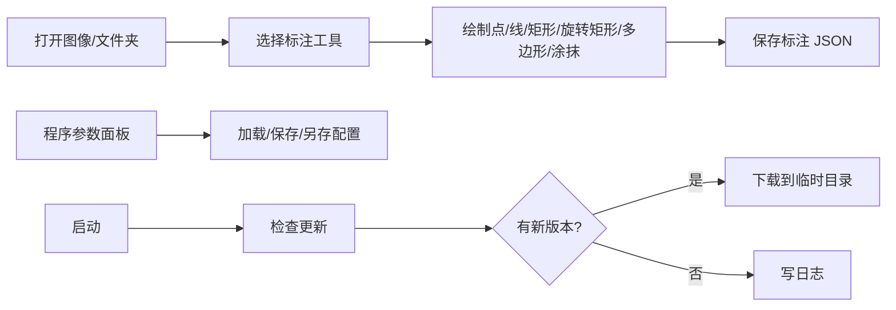
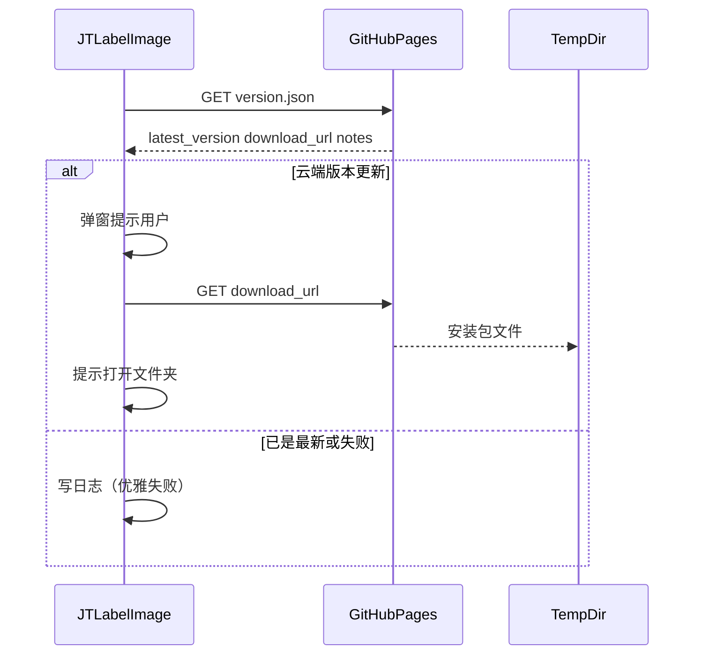

# 📘 JTLabelImage 开发文档

> 类似 LabelMe 的轻量图像标注工具 · Qt6 + C++17 + CMake + OpenCV  
> 版本号与 CMake `project(JTLabelImage VERSION …)` 保持一致

---

## 🗺️ 目录结构

```
PROJECT_DIR/
├── code/                      # 源码与 CMake 工程
│   ├── src/algo/              # 🧠 算法层
│   ├── src/widgets/           # 🎛️ Qt 控件层
│   ├── src/app/               # 🚀 程序层
│   ├── scripts/               # 编译 / 运行 / 清理 / 安装脚本
│   ├── docs/                  # 本文档
│   │   └── assets/            # 截图与媒体资源
│   ├── thirdparty/            # 第三方源码（建议只下 tag 包）
│   ├── resources/
│   └── CMakeLists.txt
├── deps_sdk/                  # 第三方 SDK 开发包
├── build_msvc/                # CMake 中间文件
├── msvc_release/              # 可执行文件与依赖 DLL
│   ├── models/
│   ├── input/
│   └── output/                # 标注 JSON / 掩膜 PNG
└── install/                   # 可选安装输出（默认不执行）
```

⚠️ **相对路径原则**：脚本用 `%~dp0` 推算根目录，运行时用 `QCoreApplication::applicationDirPath()`。移动整个 `PROJECT_DIR` 后仍可编译与运行。

---

## 🏗️ 架构



| 层级 | 职责 | 主要文件 |
| ---- | ---- | -------- |
| 🧠 algo | 形状模型、标注 JSON、图像解码、分步计时 | `Shape` `JsonIO` `ImageIO` `StepTimer` |
| 🎛️ widgets | 画布交互、日志面板 | `CanvasWidget` `LogPanel` |
| 🚀 app | 主窗口、程序配置、自动升级、入口 | `MainWindow` `AppConfig` `AutoUpdater` `main` |

---

## 🛠️ 环境依赖

| 项目 | 路径 / 说明 |
| ---- | ----------- |
| Visual Studio 2022 | `vcvars64.bat` |
| Qt6 | `D:\Qt6`（自动探测 `6.x.x\msvc2022_64`） |
| OpenCV | `D:\win10\opencv4130\build` |
| CMake | `D:\win10\cmake-4.3.2-windows-x86_64\bin\cmake.exe` |
| Ninja | `D:\win10\ninja.exe` |

---

## ⚙️ 编译

在 `code` 目录：

```bat
build.bat
```

或直接调用：

```bat
code\scripts\build.bat
```

脚本会：

1. 调用 VS 2022 `vcvars64.bat`
2. 配置 Ninja + MSVC Release
3. 输出到 `msvc_release\JTLabelImage.exe`
4. POST_BUILD 执行 `windeployqt`
5. 确保存在 `msvc_release\{models,input,output}`

手动等价命令（相对路径示例）：

```bat
set PROJECTROOT=%CD%
call "%VS_VCVARS%"
cmake.exe -S "%PROJECTROOT%\code" -B "%PROJECTROOT%\build_msvc" -G Ninja ^
  -DCMAKE_BUILD_TYPE=Release ^
  -DCMAKE_MAKE_PROGRAM=D:\win10\ninja.exe ^
  -DCMAKE_C_COMPILER=cl -DCMAKE_CXX_COMPILER=cl ^
  -DCMAKE_PREFIX_PATH="%QT_PREFIX%;D:\win10\opencv4130\build" ^
  -DOpenCV_DIR=D:\win10\opencv4130\build
cmake.exe --build "%PROJECTROOT%\build_msvc" --parallel
```

---

## ▶️ 运行

```bat
cd code
run.bat
```

或：

```bat
set PATH=%QT_PREFIX%\bin;%OPENCV_BIN%;%PATH%
msvc_release\JTLabelImage.exe
```

---

## 🧹 清理

```bat
cd code
clean.bat
```

删除 `build_msvc` 与 `msvc_release` 中的构建产物；**保留** `models` / `input` / `output` 数据目录。

---

## 📦 安装打包（可选，默认不做）

```bat
code\scripts\install.bat
```

等价于：

```bat
cmake --install build_msvc --prefix install
```

安装前请先成功编译。`windeployqt` 已在编译阶段部署 Qt 运行时。

### HTTPS / 自动升级注意 🔐

Windows 上 `windeployqt` 通常会带上 Schannel TLS 后端（`tls\qschannelbackend.dll`）。若改用 OpenSSL 后端，需额外放置：

- `libssl-*.dll`
- `libcrypto-*.dll`

否则 HTTPS 可能出现 `TLS initialization failed`。

---

## 🖥️ 界面功能速览



### 标注工具快捷键

| 工具 | 快捷键 |
| ---- | :----: |
| 选择 | `S` |
| 点 | `P` |
| 直线 | `L` |
| 矩形 | `R` |
| 旋转矩形 | `T` |
| 多边形 | `G` |
| 涂抹 | `B` |
| 适应窗口 | `F` |

### 程序配置

菜单 **文件 → 加载/保存/另存程序配置**，或右侧「程序参数」面板按钮。

默认文件：`msvc_release/kelvinlabel_config.json`

```json
{
  "inputDir": "input",
  "outputDir": "output",
  "modelsDir": "models",
  "defaultLabel": "object",
  "labelColor": "#ffff0000",
  "brushSize": 20,
  "updateUrl": "https://kelvin-luo.github.io/version.json",
  "checkUpdateOnStartup": true,
  "lastOpenDir": ""
}
```

目录字段相对于 `msvc_release`（可执行文件目录）。

### 关于 / 版本

**帮助 → 关于** 显示 CMake 项目版本（`KELVINLABEL_VERSION`）。

### 日志与计时 ⏱️

底部「日志」停靠窗输出操作日志。打开图像、保存/加载标注、配置、检查更新等步骤会用 `StepTimer` 计时，并在结束时打印汇总。

---

## 🔄 自动升级



托管样例 `version.json`（放到 GitHub Pages 根目录）：

```json
{
  "latest_version": "1.0.1",
  "download_url": "https://github.com/kelvin-luo/your-repo/releases/download/v1.0.1/JTLabelImage-setup.exe",
  "notes": "bugfix"
}
```

默认检查地址：`https://kelvin-luo.github.io/version.json`（可在参数面板修改）。若 URL 404，客户端会记录失败日志，不影响主功能。

---

## 📝 标注 JSON 格式

```json
{
  "version": "0.1",
  "imagePath": "../path/to/img.png",
  "imageWidth": 1024,
  "imageHeight": 768,
  "shapes": [
    { "type": "point", "label": "p1", "color": "#ffff0000", "points": [[x, y]] },
    { "type": "brush", "label": "road", "color": "#ff00ffff", "mask": "img_brush_0.png" }
  ]
}
```

涂抹掩膜为同目录 8 位灰度 PNG。

---

## 🖼️ 截图资源

请将界面截图保存到 [`docs/assets/`](assets/)：

| 建议文件名 | 内容 |
| ---------- | ---- |
| `ui_main.png` | 主界面总览 |
| `ui_params.png` | 程序参数面板 |
| `ui_log.png` | 日志与计时汇总 |
| `ui_about.png` | 关于对话框 |

插入示例：

```markdown

```

---

## ❓ 常见问题

1. **找不到 Qt**：确认 `D:\Qt6\6.x.x\msvc2022_64\bin\windeployqt.exe` 存在。
2. **找不到 OpenCV**：确认 `OpenCVConfig.cmake` 与 `opencv_world*.dll`。
3. **缺 DLL**：用 `run.bat` 启动，或把 Qt/OpenCV `bin` 加入 `PATH`。
4. **HTTPS 更新失败**：检查网络与 TLS 插件；必要时补 OpenSSL DLL。
5. **中文路径图像**：通过 `QFile` + `cv::imdecode` 加载，一般可用。

---

## 📎 相关文档

- 根目录简要说明：[BUILD.md](../../BUILD.md)
- 源码 README：[../README.md](../README.md)
